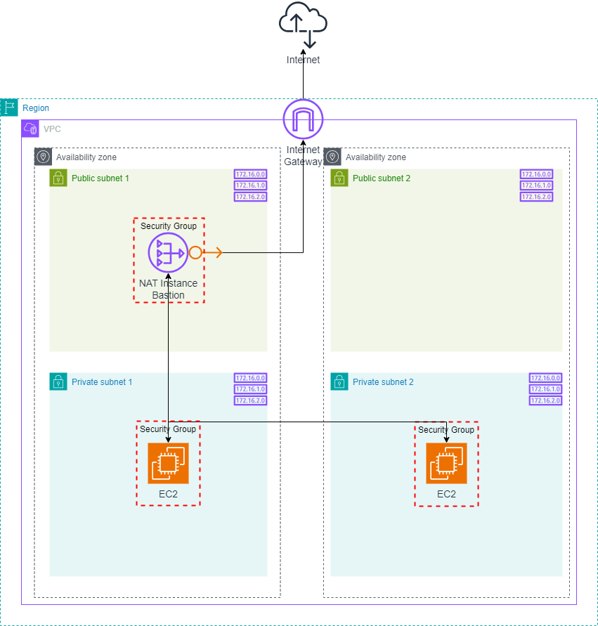
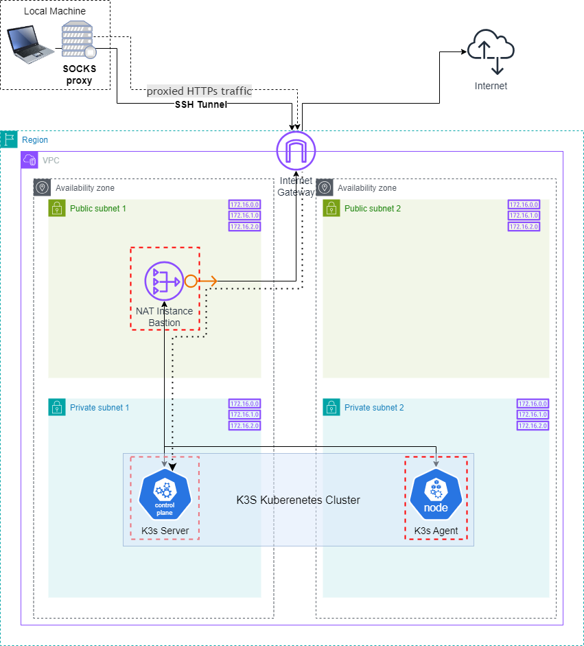
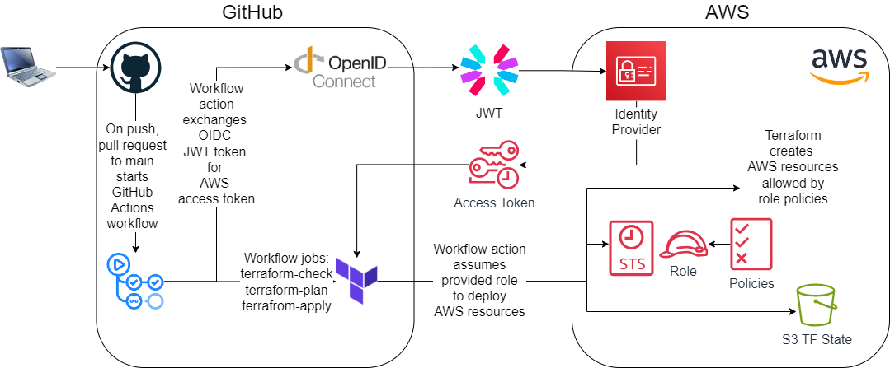

## RS School AWS DevOps Course

**Project Structure:**

```
├── .github
│   └── workflows
│       └── terraform.yml   <- github actions workflow
├── remote-state            <- remote state TF files
│       └── ...                to create S3 state bucket
├── .gitignore
├── main.tf
├── compute.tf              <- EC2 k3s server and agents
├── vpc-....tf              <- resources files for vpc/subnets/rt/gateway/nat/bastion
├── iam.tf                  <- resources files for iam
├── nacl.tf                 <- Network ACL
├── security-group.tf       <- security groups for NAT and EC2
├── key.tf                  <- generated key
├── provider.tf             <- provider configuration
├── variables.tf            <- input variables
├── output.tf               <- output values
└── ...
```

### Infractructure

Basic infrastructure configuration remains in this repo (IaC).  
Configuration (software) goes to new repo:  
**https://github.com/IlyaKozak/rsschool-devops-course-config**  
**Infrastructure Diagram:**


<details>
<summary><strong>Task 3 - K8s Cluster Configuration and Creation</strong></summary>

- Terraform code is extended to manage AWS resources required for the k3s cluster creation
- k3s cluster is created on EC2 instances by user data configuration scripts after the instance starts `user_data_k3s_server.sh` & `user_data_k3s_agent.sh`
- k3s config is copied from k3s-server `/etc/rancher/k3s/k3s.yaml` to local machine `~/.kube/config`. `server` field is changed. `proxy-url` field is added.

```yaml
apiVersion: v1
clusters:
  - cluster:
      certificate-authority-data: LRMEMMW2 # shortened for readability
      server: https://<K3S_SERVER_IP>:6443 # "Kubernetes API"
      proxy-url: socks5://localhost:1080 # "SSH SOCKS5 proxy" in the diagram below
    name: default
... # shortened for readability
```

- The following command starts a SOCKS5 proxy between local machine and remote SOCKS/SSH server behind which the Kubernetes cluster API is running (bastion host):  
   `ssh -D 1080 -q -N ec2-user@bastion-host-ip`  
  `-D 1080` - opens a SOCKS proxy on local port :1080
- Run `kubectl` locally and connect to private Kubernetes API

**k3s Kubernetes Cluster Diagram:**  


</details>

<details>
<summary><strong>Task 2 - Basic Infrastructure Configuration</strong></summary>

- Terraform code resources are added to create networking infrastructure in AWS. The infrastructure will be used for housing K8s cluster components - 1 VPC, 2 public & 2 private subnets spread across two AZs
- Internet Gateway and NAT Instance/Bastion created
- Proper routing configured

**Networking Diagram:**  


</details>

<details>
<summary><strong>Task 1 - AWS Account Configuration</strong></summary>

- Created a remote backend for Terraform (AWS S3 bucket)
- Configured OpenID Connect (OIDC) for GitHub Actions
- Created a Github Actions workflow for deployment of resources to AWS via Terraform with temporarily credentials

**OIDC Diagram:**



</details>

<hr />

**Usage:**

1. Create S3 remote state backend bucket (`remote-state` folder) and DynamoDB for state lock _[one-time setup]_:

```bash
  aws configure
  cd remote-state
  terraform init
  terraform apply
```

2. Fill out S3 bucket and DynamoDB info in `provider.tf` in `backend` block and run commands to create GithubActions role in AWS to be able create AWS resources from GitHub Actions workflow with OIDC temporarily credentials and GithubActions role to assume _[one-time setup]_:

```bash
  cd ..
  terraform init
  terraform apply
```

3. Add secret `AWS_ROLE_TO_ASSUME` and environment variable `AWS_REGION` in GitHub repo for GitHub Actions workflow to run with `workflow_dispatch` ➤ automatically `terraform apply` infractucture

4. `terraform destroy` to destroy AWS resources
